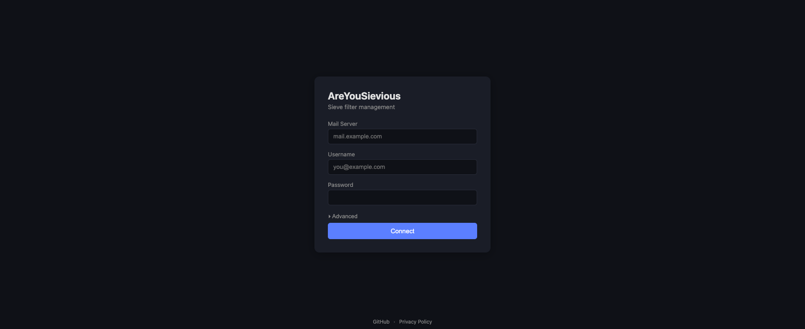
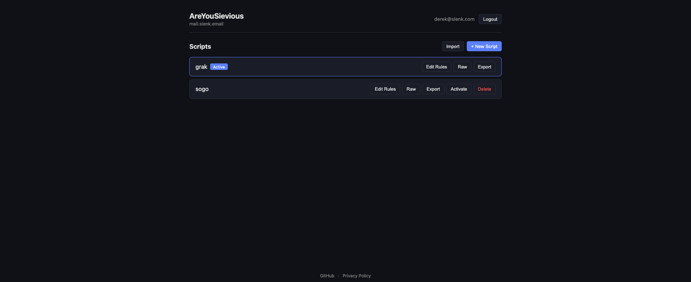
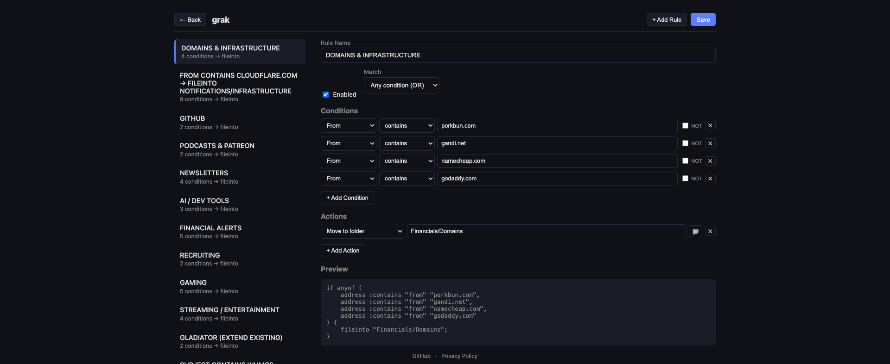

# AreYouSievious

[](LICENSE)

Self-hosted Sieve filter management for people who'd rather not write Sieve by hand.

Visual rule builder + raw editor + ManageSieve protocol. No database, no stored credentials. Your rules live on your mail server where they belong.

**Live instance:** [areyousievious.com](https://areyousievious.com)

## Screenshots

<p align="center">
  
</p>

<p align="center">
  
</p>

<p align="center">
  
</p>

## Features

- **Visual rule builder** — create filters with a point-and-click UI
- **Raw Sieve editor** — full control when you need it
- **Import/export** — backup and restore `.sieve` files
- **Folder management** — browse and create IMAP folders
- **Zero persistence** — no database, no stored passwords, credentials live in memory for 30 minutes max
- **Self-hostable** — one Docker container, no external dependencies
- **Dark mode** — because obviously

## Quick Start (Docker)

```bash
git clone https://github.com/derekslenk/AreYouSievious.git
cd AreYouSievious
docker compose up -d --build
```

Open `http://localhost:8091` and log in with your IMAP credentials.

### Environment Variables

| Variable | Default | Description |
|---|---|---|
| `AYS_CORS_ORIGINS` | `https://areyousievious.com` | Comma-separated allowed origins |
| `AYS_SECURE_COOKIES` | _(unset)_ | Set to `true` when behind HTTPS reverse proxy |

## Quick Start (Manual)

```bash
# Frontend
cd frontend && npm install && npm run build

# Backend
cd backend && pip install -r requirements.txt
python app.py --port 8091 --static ../frontend/dist
```

## Requirements

Your mail server needs:
- **IMAP** (port 993, SSL) — for authentication and folder listing
- **ManageSieve** (port 4190) — for filter management ([RFC 5804](https://datatracker.ietf.org/doc/html/rfc5804))

Most self-hosted mail servers support this out of the box (Dovecot, Mailcow, Mail-in-a-Box, etc).

## Stack

- **Frontend:** Svelte + Vite
- **Backend:** Python + FastAPI
- **Protocol:** ManageSieve (RFC 5804) + IMAP
- **Database:** None. State lives on your mail server.

## Production Deployment

For public-facing deployments, put it behind a reverse proxy with TLS:

```nginx
server {
    listen 443 ssl;
    server_name your-domain.com;

    # ... SSL config ...

    location / {
        proxy_pass http://127.0.0.1:8091;
        proxy_set_header Host $host;
        proxy_set_header X-Real-IP $remote_addr;
        proxy_set_header X-Forwarded-For $proxy_add_x_forwarded_for;
        proxy_set_header X-Forwarded-Proto https;
    }
}
```

Bind Docker to localhost only:
```yaml
ports:
  - "127.0.0.1:8091:8091"
```

Set `AYS_SECURE_COOKIES=true` and `AYS_CORS_ORIGINS=https://your-domain.com`.

## Security

- Credentials are held in memory only, never written to disk
- Sessions expire after 30 minutes of inactivity
- SSRF protection prevents connections to private/internal networks
- Rate limiting on login (5 attempts per 5 minutes per IP)
- HttpOnly, Secure, SameSite=Strict session cookies

See the [privacy policy](https://areyousievious.com/#privacy) for the full story.

## Docs

- [Architecture](docs/ARCHITECTURE.md)
- [Contributing](CONTRIBUTING.md)
- [Code of Conduct](CODE_OF_CONDUCT.md)

## License

[MIT](LICENSE)
